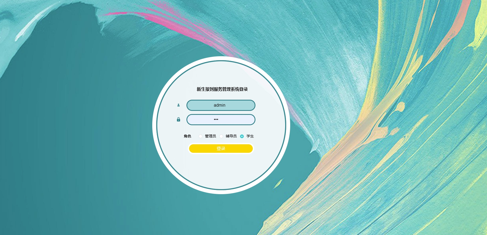

# 基于SSM的大学新生报到系统

#### 1.介绍
基于SSM的大学新生报到系统,本人环境：idea2022， tomcat8.5， MySQL5.7，

技术栈： SSM，Vue（管理web是dist文件）

角色：管理员，学生，辅导员

#### 2.部署/安装教程
-  导入数据库(使用navicat或者其他工具，我的数据库编码是utf8mb4，排序默认）

-  按照你的数据库环境，修改代码

- 配置Tomcat，启动项目，注意Tomcat的application context路径

- 后台管理web：http://localhost:8080/springboot169er/admin/dist/index.html  账号密码查看数据库

#### 3.项目部分截图

#### 4.获取方式
获取方式：[戳我查看](https://gitee.com/aven999/mall)💕
